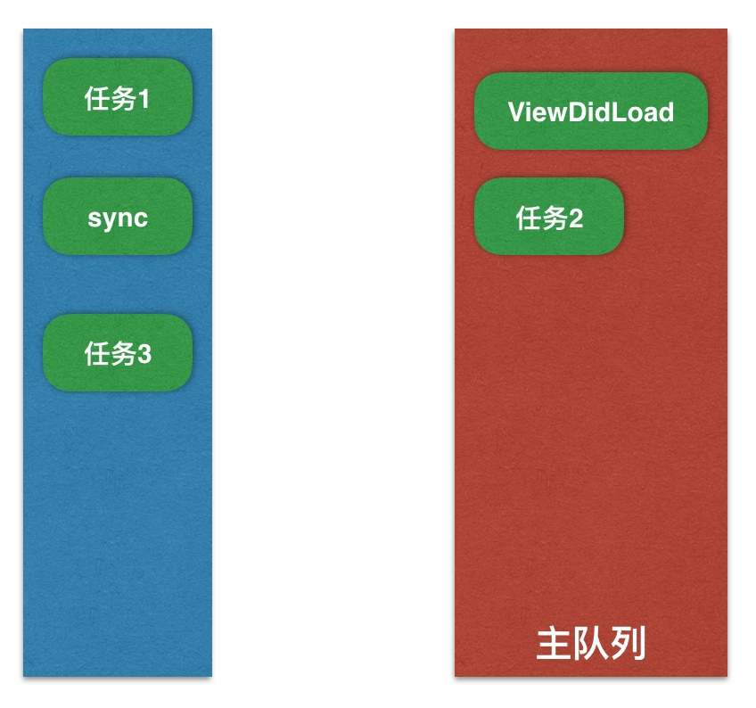

# README

[TOC]

[参考资料 1](https://www.jianshu.com/p/e883cc573dcf?utm_campaign=maleskine&utm_content=note&utm_medium=seo_notes&utm_source=recommendation)

[参考资料 2 简书地址](https://www.jianshu.com/p/4b1d77054b35)


## NSOperation

使用子类

- NSInvocationOperation
- NSBlockOperation

NSOperation 底层就是 GCD, 只不过比 GCD 更加面向对象,多了一些更简单实用的功能.

#### NSInvocationOperation

```objc
- (void)useInvocationOperation {
    NSInvocationOperation *op = [[NSInvocationOperation alloc] initWithTarget:self selector:@selector(task1) object:nil];
    [op start];
}

- (void)task1 {
    for (int i = 0; i< 2; i++) {
        [NSThread sleepForTimeInterval:2];
        NSLog(@"1---%@",[NSThread currentThread]);
    }
}

// 打印:
// 1---<_NSMainThread: 0x7fd220804ed0>{number = 1, name = main}
// 1---<_NSMainThread: 0x7fd220804ed0>{number = 1, name = main}
```

可以看出, 在没有使用 `NSOperationQueue`, 在主线程中单独使用子类`NSInvocationOperation`执行一个操作的情况下, 操作是在`当前线程执行的, 并没有开启新线程.`

#### NSBlockOperation

```objc
- (void)useBlockOperation {
    NSBlockOperation *op = [NSBlockOperation blockOperationWithBlock:^{
        for (int i = 0; i < 2; i++) {
            [NSThread sleepForTimeInterval:2];
            NSLog(@"2----%@",[NSThread currentThread]);
        }
    }];
    [op start];
}

// 打印
// 2----<_NSMainThread: 0x7fe086d04ed0>{number = 1, name = main}
// 2----<_NSMainThread: 0x7fe086d04ed0>{number = 1, name = main}
```

可以看出, 没有使用`NSOperationQueue`, 在主线程中使用`NSOperationBlock`执行一个操作的情况下, `在当前线程执行的, 没有开启新的线程`.

##### addExecutionBlock

可以使用 `addExecutionBlock`添加操作

```objc
- (void)useBlockOperationAddExecutionBlock {
    NSBlockOperation *op = [NSBlockOperation blockOperationWithBlock:^{
        for (int i = 0; i<2; i++) {
            [NSThread sleepForTimeInterval:2];
            NSLog(@"1---%@",[NSThread currentThread]);
        }
    }];
    
    [op addExecutionBlock:^{
        for (int i = 0; i<2; i++) {
            [NSThread sleepForTimeInterval:2];
            NSLog(@"2---%@",[NSThread currentThread]);
        }
    }];
    
    [op addExecutionBlock:^{
        for (int i = 0; i<2; i++) {
            [NSThread sleepForTimeInterval:2];
            NSLog(@"3---%@",[NSThread currentThread]);
        }
    }];
    
    [op addExecutionBlock:^{
        for (int i = 0; i<2; i++) {
            [NSThread sleepForTimeInterval:2];
            NSLog(@"4---%@",[NSThread currentThread]);
        }
    }];
    
    [op addExecutionBlock:^{
        for (int i = 0; i<2; i++) {
            [NSThread sleepForTimeInterval:2];
            NSLog(@"5---%@",[NSThread currentThread]);
        }
    }];
    
    [op addExecutionBlock:^{
        for (int i = 0; i<2; i++) {
            [NSThread sleepForTimeInterval:2];
            NSLog(@"6---%@",[NSThread currentThread]);
        }
    }];
    
    [op addExecutionBlock:^{
        for (int i = 0; i<2; i++) {
            [NSThread sleepForTimeInterval:2];
            NSLog(@"7---%@",[NSThread currentThread]);
        }
    }];
    
    [op addExecutionBlock:^{
        for (int i = 0; i<2; i++) {
            [NSThread sleepForTimeInterval:2];
            NSLog(@"8---%@",[NSThread currentThread]);
        }
    }];
    
    [op start];
}

/**
 1---<NSThread: 0x7fe31f744780>{number = 8, name = (null)}
 2---<_NSMainThread: 0x7fe320018510>{number = 1, name = main}
 4---<NSThread: 0x7fe3200c7470>{number = 9, name = (null)}
 3---<NSThread: 0x7fe3205a9f40>{number = 10, name = (null)}
 1---<NSThread: 0x7fe31f744780>{number = 8, name = (null)}
 2---<_NSMainThread: 0x7fe320018510>{number = 1, name = main}
 3---<NSThread: 0x7fe3205a9f40>{number = 10, name = (null)}
 4---<NSThread: 0x7fe3200c7470>{number = 9, name = (null)}
 5---<NSThread: 0x7fe31f744780>{number = 8, name = (null)}
 6---<NSThread: 0x7fe3205a9f40>{number = 10, name = (null)}
 8---<NSThread: 0x7fe3200c7470>{number = 9, name = (null)}
 7---<_NSMainThread: 0x7fe320018510>{number = 1, name = main}
 5---<NSThread: 0x7fe31f744780>{number = 8, name = (null)}
 6---<NSThread: 0x7fe3205a9f40>{number = 10, name = (null)}
 7---<_NSMainThread: 0x7fe320018510>{number = 1, name = main}
 8---<NSThread: 0x7fe3200c7470>{number = 9, name = (null)} 
 2---<NSThread: 0x7fe3205a9f40>{number = 10, name = (null)}
 1---<_NSMainThread: 0x7fe320018510>{number = 1, name = main}
 3---<NSThread: 0x7fe320597520>{number = 11, name = (null)}
 4---<NSThread: 0x7fe31f772a40>{number = 12, name = (null)}
 2---<NSThread: 0x7fe3205a9f40>{number = 10, name = (null)}
 1---<_NSMainThread: 0x7fe320018510>{number = 1, name = main}
 3---<NSThread: 0x7fe320597520>{number = 11, name = (null)}
 4---<NSThread: 0x7fe31f772a40>{number = 12, name = (null)}
 5---<_NSMainThread: 0x7fe320018510>{number = 1, name = main}
 6---<NSThread: 0x7fe3205a9f40>{number = 10, name = (null)}
 8---<NSThread: 0x7fe31f772a40>{number = 12, name = (null)}
 7---<NSThread: 0x7fe320597520>{number = 11, name = (null)}
 5---<_NSMainThread: 0x7fe320018510>{number = 1, name = main}
 6---<NSThread: 0x7fe3205a9f40>{number = 10, name = (null)}
 8---<NSThread: 0x7fe31f772a40>{number = 12, name = (null)}
 7---<NSThread: 0x7fe320597520>{number = 11, name = (null)}
*/
```

可以看出`addExecutionBlock`中操作在不同线程并发执行.

是否开启线程, 取决于操作个数, 当然也由系统决定.

#### 自定义 NSOperation

继承自 `NSOperation`. 重写`main`

```objc

@implementation TYOperation

- (void)main {
    if (!self.isCancelled) {
        for (int i = 0; i < 2; i++) {
            [NSThread sleepForTimeInterval:2];
            NSLog(@"1---%@",[NSThread currentThread]);
        }
    }
}

@end

- (void)useTYOperation {
    TYOperation *op = [[TYOperation alloc] init];
    [op start];
}

//打印
// 1---<_NSMainThread: 0x7f79aed056e0>{number = 1, name = main}
// 1---<_NSMainThread: 0x7f79aed056e0>{number = 1, name = main}
```

### NSOperationQueue

- 主队列
- 自定义队列

添加到主队列的操作, 一般都会放到主线程执行, 除了使用`addExecutionBlock`添加的额外操作可能在其他线程执行.

```objc
NSOperationQueue *queue = [NSOperationQueue mainQueue];
```

添加到自定义队列, 会自动放到子线程执行, 同时包含了, 串行, 并发功能.

```objc
NSOperationQueue *queue = [[NSOperationQueue alloc] init];
```

##### addOperation

将操作添加到队列

```objc
- (void)addOperationToQueue {
    NSOperationQueue *queue = [[NSOperationQueue alloc] init];
    
    NSInvocationOperation *op1 = [[NSInvocationOperation alloc] initWithTarget:self selector:@selector(task1) object:nil];
    
    NSInvocationOperation *op2 = [[NSInvocationOperation alloc] initWithTarget:self selector:@selector(task2) object:nil];
    
    NSBlockOperation *op3 = [NSBlockOperation blockOperationWithBlock:^{
        for (int i = 0; i < 2; i++) {
            [NSThread sleepForTimeInterval:2];
            NSLog(@"3---%@",[NSThread currentThread]);
        }
    }];
    
    [op3 addExecutionBlock:^{
        for (int i = 0; i < 2; i++) {
            [NSThread sleepForTimeInterval:2];
            NSLog(@"4---%@",[NSThread currentThread]);
        }
    }];
    
    [queue addOperation:op1];
    [queue addOperation:op2];
    [queue addOperation:op3];
    
}

2---<NSThread: 0x7fd926f2c1b0>{number = 3, name = (null)}
4---<NSThread: 0x7fd927d45fa0>{number = 4, name = (null)}
1---<NSThread: 0x7fd926f454f0>{number = 6, name = (null)}
3---<NSThread: 0x7fd926f28530>{number = 7, name = (null)}
2---<NSThread: 0x7fd926f2c1b0>{number = 3, name = (null)}
4---<NSThread: 0x7fd927d45fa0>{number = 4, name = (null)}
1---<NSThread: 0x7fd926f454f0>{number = 6, name = (null)}
3---<NSThread: 0x7fd926f28530>{number = 7, name = (null)}
```

可以看出, 开启新线程, 并发执行


```objc
- (void)addOperationBlockQueue {
    NSOperationQueue *queue = [[NSOperationQueue alloc] init];
    [queue addOperationWithBlock:^{
        for (int i = 0; i < 2; i++) {
            [NSThread sleepForTimeInterval:2];
            NSLog(@"1---%@",[NSThread currentThread]);
        }
    }];
    [queue addOperationWithBlock:^{
        for (int i = 0; i < 2; i++) {
            [NSThread sleepForTimeInterval:2];
            NSLog(@"2---%@",[NSThread currentThread]);
        }
    }];
    [queue addOperationWithBlock:^{
        for (int i = 0; i < 2; i++) {
            [NSThread sleepForTimeInterval:2];
            NSLog(@"3---%@",[NSThread currentThread]);
        }
    }];
}

```

#### 控制最大并发数 maxConcurrentOperationCount

- 默认值 -1, 表示不尽兴限制并发数
- 值为 1, 表示队列为串行队列.只能串行执行
- 值大于 1, 并发队列. 但不能超系统限制, 无线设置大值也没用.

```objc
- (void)addOperationBlockQueue {
    NSOperationQueue *queue = [[NSOperationQueue alloc] init];
    
  
    queue.maxConcurrentOperationCount = 2;	// 控制最大并发数, 如果为 1, 则串行, 大于 1 或不设置则并发
    
    [queue addOperationWithBlock:^{
        for (int i = 0; i < 2; i++) {
            [NSThread sleepForTimeInterval:2];
            NSLog(@"1---%@",[NSThread currentThread]);
        }
    }];
    [queue addOperationWithBlock:^{
        for (int i = 0; i < 2; i++) {
            [NSThread sleepForTimeInterval:2];
            NSLog(@"2---%@",[NSThread currentThread]);
        }
    }];
    [queue addOperationWithBlock:^{
        for (int i = 0; i < 2; i++) {
            [NSThread sleepForTimeInterval:2];
            NSLog(@"3---%@",[NSThread currentThread]);
        }
    }];
}
```

#### 操作依赖

```objc
- (void)addDependency {
    NSOperationQueue *queue = [[NSOperationQueue alloc] init];
    
    queue.maxConcurrentOperationCount = 2;
    
    NSBlockOperation *op1 = [NSBlockOperation blockOperationWithBlock:^{
        for (int i = 0; i < 2; i++) {
            [NSThread sleepForTimeInterval:2];
            NSLog(@"1---%@",[NSThread currentThread]);
        }
    }];
    
    NSBlockOperation *op2 = [NSBlockOperation blockOperationWithBlock:^{
        for (int i = 0; i < 2; i++) {
            [NSThread sleepForTimeInterval:2];
            NSLog(@"2---%@",[NSThread currentThread]);
        }
    }];
    
    // op2 依赖 op1
    [op2 addDependency:op1];
    
    [queue addOperation:op1];
    [queue addOperation:op2];
}

// 先执行完 op1, 再执行 op2, 貌似不收并发数限制, 一个一个执行的 op1, 然后一个一个执行的 op2
```

#### NSOperation 优先级

适用于同一操作队列, 不适用于不同的操作队列.

#### 线程间通信

```objc
- (void)comunication {
    NSOperationQueue *queue = [[NSOperationQueue alloc] init];
    [queue addOperationWithBlock:^{
        for (int i = 0; i < 2; i++) {
            [NSThread sleepForTimeInterval:2];
            NSLog(@"1---%@",[NSThread currentThread]);
        }
        
        // 回主线程
        [[NSOperationQueue mainQueue] addOperationWithBlock:^{
            for (int i = 0; i < 2; i++) {
                [NSThread sleepForTimeInterval:2];
                NSLog(@"2---%@",[NSThread currentThread]);
            }
        }];
    }];
}

//打印
1---<NSThread: 0x7f89f37264a0>{number = 8, name = (null)}
1---<NSThread: 0x7f89f37264a0>{number = 8, name = (null)}
2---<_NSMainThread: 0x7f89f4506bf0>{number = 1, name = main}
2---<_NSMainThread: 0x7f89f4506bf0>{number = 1, name = main}
```


### GCD 常用函数

#### 同步

```objc
dispatch_sync(dispatch_queue_t queue, dispatch_block_t block);
```

- 同步就表示立马在`当前线程`上执行任务.且执行完毕才能继续往下执行 

#### 异步

```objc
dispatch_async(dispatch_queue_t queue, dispatch_block_t block);
```

- 异步就表示`具备开启子线程`的能力,但有特殊情况不会在子线程执行,如传入`主队列`的时候.

同步和异步并不能影响任务是串行还是并发,只能决定任务在哪个线程中执行.

### GCD 的队列

> 总结下:
>
> 1. `async` 异步函数, 具备开启子线程的能力, 但是传入的非主队列才行, 如果传入主队列, 还是主线程
> 2. `sync` 同步函数, 立马在当前线程执行任务.
> 3. 串行队列. 如`DISPATCH_QUEUE_SERIAL`. 表示任务一个接一个的执行.
> 4. 并发队列, 如 `DISPATCH_QUEUE_CONCURRENT`, 表示多个任务可同时并发执行
> 5. 队列是先进先出.
> 6. 同一个队列, 如果是`sync`函数, 如果有多个任务, 必须等一个任务执行完了, 再执行下一个.
> 7. 不同队列, 如果`sync`函数 , 可能互相之间没有影响

#### 并发队列

- 可以让多个任务 `并发(同时)` 执行
- 自动开启多个线程同时执行任务
- 并发功能`只有`在`异步(dispatch_async)`这个函数下才有效.

#### 串行队列

- 让任务一个接着一个的执行(一个任务执行完毕后,再执行下一个任务).

#### 各种队列执行效果

- 只要是`同步函数(sync)`或`主队列`, 就会
    - `没有`开启新线程
    - `串行`执行任务
- 如果是`异步函数(async)`
    - `并发队列` 下:
        - `有`开启新线程
        - `并发`执行任务
    - `手动创建的串行队列`下:
        - `有`开启新线程
        - `串行`执行任务

### 死锁

##### 1.问: 以下代码会不会产生死锁?

```objc
- (void)viewDidLoad {
    [super viewDidLoad];
    
    NSLog(@"执行任务1");
    
    dispatch_queue_t queue = dispatch_get_main_queue();
    dispatch_sync(queue, ^{
        NSLog(@"执行任务2");
    });
    
    NSLog(@"执行任务3");
}
```

答: 会产生死锁.

- 队列: 先进先出.
- `sync`: 表示立马在当前线程执行任务,即主线程.
- `ViewDidLoad`这个方法也是在主线程执行任务.



- 上面会先执行 `任务1`.
- 然后执行`sync`函数,那么就要取出`任务2`.
- 因为是`sync`同步函数,那么就要求立马执行`任务2`,且必须执行完毕才能往下走. 
- 如果要执行`任务3`,那么就必须等`sync`执行完, 即`任务2`执行完.但是要想执行`任务2`,必须等`ViewDidLoad`这个执行完,才能从队列中取出`任务2`.
- 所以`任务2`等待`ViewDidLoad`, 而`ViewDidLoad`中的`任务3`又等`任务2`,形成死锁.

##### 2.问: 下面这个会不会产生死锁? (将上面的 `sync` 改为 `async`)

```objc
- (void)viewDidLoad {
    [super viewDidLoad];
    
    NSLog(@"执行任务1");
    
    dispatch_queue_queue = dispatch_get_main_queue();
    dispatch_async(queue, ^{
        NSLog(@"执行任务2");
    });
    
    NSLog(@"执行任务3");
    
}
```

答: 不会产生死锁!

- `async` 异步函数,可以开启子线程,但是因为传入的是`主队列`,所以`任务2`还是在主线程执行.
- 但是`async`异步函数,不要求立马在当前线程同步执行任务,所以它会等,等第一个执行完了,再执行自己的.
- 所以继续用上面的图,那么就会等`viewDidLoad`执行完毕,再执行`任务2`.
- 所以打印结果: 先`执行任务1`->`执行任务3`->`执行任务2`.

##### 3. 问: 下面这个会不会产生死锁?

```objc
- (void)viewDidLoad {
    [super viewDidLoad];
    
    NSLog(@"执行任务1");
    
    dispatch_queue_t queue = dispatch_queue_create("MyQueue", DISPATCH_QUEUE_SERIAL);
    dispatch_async(queue, ^{
        NSLog(@"执行任务2");
        dispatch_sync(queue,^(
            NSLog(@"执行任务3");
        ));
        NSLog(@"执行任务4");
    });
    NSLog(@"执行任务5");
}
```

答: 会死锁!

先说打印结果:

- `执行任务1 -> 执行任务5 -> 执行任务2 ->死锁`
- `任务1`和`任务5`因为都在主线程执行,并且是`async`异步函数,并且是`串行队列`,那么就不用等待`async`这个函数执行完,所以会先执行`任务1`,再执行`任务5`.
- 因为是串行队列和异步函数,所以会在子线程执行`任务2,任务3,任务4`.
- 首先会执行`任务2`,然后第一个 block 里还有个`任务4`没有执行完.但是这里有`sync`同步函数,那么就表示要立马在当前线程执行,但是`任务3`是在第一个 block后面,所以`任务3`等待第一个 block 执行完,而第一个 block 又要等`任务3`执行完,才能执行`任务4`,所以死锁.

##### 4.问: 会不会产生死锁? (将3题中的队列换为并发队列)


```objc
- (void)viewDidLoad {
    [super viewDidLoad];
    
    NSLog(@"执行任务1");
    
    dispatch_queue_t queue = dispatch_queue_create("MyQueue", DISPATCH_QUEUE_SERIAL);
    dispatch_queue_t queue2 = dispatch_queue_create("MyQueue2", DISPATCH_QUEUE_CONCURRENT);
    dispatch_async(queue, ^{
        NSLog(@"执行任务2");
        dispatch_sync(queue2,^(
            NSLog(@"执行任务3");
        ));
        NSLog(@"执行任务4");
    });
    NSLog(@"执行任务5");
}
```

答: 不会产生死锁.

打印: `执行任务1 -> 执行任务5 -> 执行任务2 -> 执行任务3 -> 执行任务4`.


##### 总结一句会产生死锁的情况

- 使用`sync`函数,往`当前串行`(就是同一个队列)队列中添加任务,就会产生死锁,会卡住当前的串行队列.
    - `sync` 意味执行当前这个才能往下走. 

##### 5.以下代码打印结果是什么?

```objc
dispatch_queue_t queue = dispatch_get_global_queue(0,0);
// 如果换成 dispatch_get_main_queue() 主线程, 那么下面 [self performSelector:@selector(test) withObject:nil afterDelay: 0.0]; 就会执行了, 主线程默认开启 RunLoop
dispatch_async(queue, ^{
    NSLog(@"1");
    [self performSelector:@selector(test) withObject:nil afterDelay: 0.0];
    
    NSLog(@"3");
});

- (void)test {
    NSLog(@"2");
}
```

打印结果: `1, 3`.

- 这个为什么没有打印 `2`?
- 因为`performSelector: withObject: afterDelay:` 相当于往 RunLoop 中添加定时器,`.0`秒也是定时器,`.0`后执行.
- 而这里是在子线程里.因为`子线程默认没有开启 RunLoop`,所以这句代码没有执行.

##### 6.将上面5题的去掉`afterDelay`

```objc
dispatch_queue_t queue = dispatch_get_global_queue(0,0);
dispatch_async(queue, ^{
    NSLog(@"1");
    [self performSelector:@selector(test) withObject:nil];
    
    NSLog(@"3");
});

- (void)test {
    NSLog(@"2");
}
```

打印结果 : `1, 2, 3`

- `performSelector: withObject:` 这个代码的本质就是`objc_msgSend`

##### 7.将5题的子线程换为主线程中执行

```objc
- (void)touchesBegan:(NSSet<UITouch *> *)touches withEvent:(UIEvent *)event {
    NSLog(@"1");
    [self performSelector:@selector(test) withObject:nil afterDelay:.0];
    NSLog(@"3");
}

- (void)test {
    NSLog(@"2");
}
```

打印结果: `1, 3, 2`.

- `performSelector:SEL withObject: afterDelay:` 相当于往 RunLoop 中添加了一个定时器. RunLoop 被唤醒可能会有一定的时间,所以132.
- 这里实在主线程执行的,主线程默认开启 RunLoop 了.

##### 8. 下面代码打印结果是什么? 

```objc
- (void)test {
    NSLog(@"2");
}

- (void)touchesBegan:(NSSet <UITouch *> *)touches withEvent:(UIEvent *)event {
    NSThread *thread = [[NSThread alloc] initWithBlock:^{
        NSLog(@"1");
    }];
    [thread start];
    [self performSelector:@selector(test) onThread:thread withObject:nil waitUntilDone:YES];
}
```

打印结果 : 1, 然后程序崩溃

- 线程 `start` 后,打印 `1`.
- 执行完 block 内容后,线程退出了,所以再执行`perform..`就会崩溃了.
- 如果启动 RunLoop, 不让线程死就没事了

```objc
- (void)touchesBegan:(NSSet <UITouch *> *)touches withEvent:(UIEvent *)event {
    NSThread *thread = [[NSThread alloc] initWithBlock:^{
        NSLog(@"1");
        [[NSRunLoop currentRunLoop] addPort:[NSPort new] forMode:NSRunLoopCommonModes];
        [[NSRunLoop currentRunLoop] run];    
    }];
    [thread start];
    [self performSelector:@selector(test) onThread:thread withObject:nil waitUntilDone:YES];
}
```

### 队列组

```objc
dispatch_group_t group = dispatch_group_create();
    dispatch_group_async(group, dispatch_get_global_queue(0, 0), ^{
        for (int i = 0; i < 10; i++) {
            NSLog(@"执行任务1");
        }
    });
    
    dispatch_group_async(group, dispatch_get_global_queue(0, 0), ^{
        for (int i = 0; i < 10; i++) {
            NSLog(@"执行任务2");
        }
    });
    
    // 等上面的执行完了
    dispatch_group_notify(group, dispatch_get_global_queue(0, 0), ^{
        for (int i = 0; i < 10; i++) {
            NSLog(@"执行任务3");
        }
    });
```

### 多线程的安全隐患

- 资源共享,被多条线程同时访问一个资源,数据容易错乱.

#### 解决方案

- 使用`线程同步`技术.(同步就是使他们按预先定好的先后顺序来进行).
- 常见的线程同步技术: `加锁`.

#### OSSpinLock 自旋锁

`OSSpinLock` 叫自旋锁, 等待锁的线程会处于忙等 (busy-wait) 状态,一直占用着 CPU 资源.

- 当多条线程访问`同一个`变量时,大家都要用`同一把锁`.才能确保线程同步,否则都用新的锁,不能解决问题.

```objc
// 导入头文件
import <libkern/OSAtomic>

// 定义一个锁
@property (nonatomic, assign) OSSpinLock lock;

// 初始化锁
OSSpinLock lock = OS_SPINLOCK_INIT;

// 加锁 
OSSpinLockLock(&_lock);

// 解锁
OSSpinLockUnlock(&_lock);

```

- 当其他线程访问过来时,如果发现已经被加锁了,那么就处于忙等的状态,相当于一个`while(1)`,会一直占用着 CPU 资源.(自旋锁,自己在那一直转).
- 目前这个 `OSSpinLock` 自旋锁已经不安全了,可能会出现`优先级反转的问题`.
    - 因为多线程的原理就是,多条线程之间快速的调度,让人看起来像是一起工作而已,那么每条线程系统都会为其分配优先级,如果第一次一个低优先级的线程进来了,发现锁没有加,那么它会加锁.此时如果优先级高的线程进来,那么就会一直处于忙等状态,系统会为优先级高的线程分配任务,那么它就会一直在那等,低优先级的线程因为没有被分配,所以不执行,那么这个锁就有可能不会被解开.


#### os_unfair_lock

因为`OSSpinLock`有安全隐患, 在`iOS 10`之后,建议用 `os_unfair_lock` 取代.

- `os_unfair_lock` 等待时会处于 `休眠` 状态, 并非忙等.

```objc
// 导入头文件 
import <os/lock.h>
// 初始化锁
os_unfair_lock lock = OS_UNFAIR_LOCK_INIT;
// 尝试加锁
os_unfair_lock_trylock(&lock);
// 加锁
os_unfair_lock_lock(&lock);
// 解锁
os_unfair_lock_unlock(&lock);
```

不解锁导致其他线程都卡在那里,叫`死锁`.

#### pthread_mutex 

##### 互斥锁

带`pthread`都是跨平台的.

- `mutex` 叫做 `互斥锁`, 等待锁的线程会处于休眠状态.

```objc
// 导入头文件
import <pthread.h>
// 第一种初始化方式: 静态初始化,这种不能用属性保存,右边是结构体,这里不能使用 self.mutex = PTHREAD_MUTEX_INITIALIZER;
pthread_mutex_t mutex = PTHREAD_MUTEX_INITIALIZER;

// 第二种初始化方式:
// 初始化属性
pthread_mutexattr_t attr;
pthread_mutexattr_init(&attr);
pthread_mutexattr_settype(&attr, PTHREAD_MUTEX_DEFAULT);
// 初始化锁
pthread_mutex_init(&_mutex, &attr);
// 销毁属性
pthread_mutexattr_destroy(&attr);

// 加锁
pthread_mutex_lock(&_mutex);
// 解锁
pthread_mutex_unlock(&_mutex);
```

##### 递归锁

```objc
pthread_mutexattr_settype(&attr, PTHREAD_MUTEX_RECURSIVE);
```

#### NSLock

`NSLock` 是对`mutex` 普通锁的封装

```objc
@interface NSLock : NSObject <NSLocking> {
@private
    void *_priv;
}

// 尝试加锁
- (BOOL)tryLock;
// 在这个时间,如果找到这个锁,就加锁,返回 YES, 如果被人没有解锁,返回 NO;
- (BOOL)lockBeforeDate:(NSDate *)limit;

@property (nullable, copy) NSString *name API_AVAILABLE(macos(10.5), ios(2.0), watchos(2.0), tvos(9.0));

@end
```

```objc
@protocol NSLocking 
- (void)lock;
- (void)unlock;
@end
```

#### NSRecursiveLock 

`NSRecursiveLock` 是对 `mutex` 的 `递归锁` 的封装, API 和 NSLock 差不多.

#### NSCondition

`NSCondition` 是对 `mutex` 和 `cond` 的封装

```objc
@interface NSCondition : NSObject <NSLocking> {
@private
    void *_priv;
}

- (void)wait;
- (BOOL)waitUntilDate:(NSDate *)limit;
- (void)signal;
- (void)broadcast;

@property (nullable, copy) NSString *name API_AVAILABLE(macos(10.5), ios(2.0), watchos(2.0), tvos(9.0));

@end
```

#### NSConditionLock

对 `NSCondition` 的进一步的封装, 可以设置具体的条件值.

```objc
@interface NSConditionLock : NSObject <NSLocking> {
@private
    void *_priv;
}

- (instancetype)initWithCondition:(NSInteger)condition NS_DESIGNATED_INITIALIZER;

@property (readonly) NSInteger condition;
- (void)lockWhenCondition:(NSInteger)condition;
- (BOOL)tryLock;
- (BOOL)tryLockWhenCondition:(NSInteger)condition;
- (void)unlockWithCondition:(NSInteger)condition;
- (BOOL)lockBeforeDate:(NSDate *)limit;
- (BOOL)lockWhenCondition:(NSInteger)condition beforeDate:(NSDate *)limit;

@property (nullable, copy) NSString *name API_AVAILABLE(macos(10.5), ios(2.0), watchos(2.0), tvos(9.0));

@end
```

#### dispatch_queue

直接使用 GCD 的串行队列, 也可以实现线程同步.

#### dispatch_semaphore 信号量

信号量的初始值, 可以用来控制线程并发访问的最大数量.

- 信号量的初始值为 1, 表示只允许 1 条线程访问资源, 保证线程同步.

```objc
// 初始化信号量
dispatch_semaphore_t semaphore = dispatch_semaphore_create(1);

// 如果信号量的值 <= 0, 当前线程就会进入休眠等待 (直到信号量的值 > 0)
// 如果信号量的值 > 0, 就减去 1, 然后往下执行后面的代码
dispatch_semaphore_wait(semaphore, DISPATCH_TIME_FOREVER);

// 信号量的值加 1
dispatch_semaphore_signal(semaphore);
```

#### @synchronized

对 `mutex` 递归锁的封装.

#### 性能比较

从高到低

- os_unfair_lock
- OSSpinLock
- dispatch_semaphore
- pthread_mutex
- dispatch_queue(DISPATCH_QUEUE_SERIAL)
- NSLock
- NSCondition
- pthread_mutex(recursive)
- NSRecursiveLock
- NSConditionLock
- @synchronized

#### OC 中你了解的锁有哪些?

上面

#### 自旋锁和互斥锁对比?

#### 什么时候使用自旋锁比较划算?

自旋锁就是一直忙等.

- 预计线程等待锁的时间很短
- 加锁的代码(临界区)经常被调用,但竞争情况很少发生
- CPU 资源不紧张
- 多核处理器

#### 什么情况下使用互斥锁比较划算?

- 预计线程等待锁的时间较长
- 单核处理器
- 临界区有 IO 操作,文件操作
- 临界区代码比较复杂,或者循环量大
- 临界区竞争非常激烈

### atomic

- 原子性,保证属性的 setter 方法和 getter 方法是原子性操作, 就是说保证 setter 和 getter 方法内部是线程同步的.

通过源码,看一下:

```objc
// setter 方法
if(!atomic) {
// 直接赋值
    oldValue = *shot;
    *shot = newValue;
} else {
    spinlock_t &slotlock = PropertyLocks[slot];
    &lotlock.lock();
    oldValue = *slot;
    *slot = newValue;
    slotlock.unlock();
}

// getter
// 如果不是 atomic, 直接返回
if (!atomic) return *slot;
// 是 atomic, 加锁
spinlock_t &slotlock = PropertyLocks[slot];
slotlock.lock();
id value = objc_retain(*slot);
slotlock.unlock();
```

### 读写安全方案. IO 操作(文件操作)

文件等数据读写操作,多读多写的情况.

- `pthread_rwlock`: 读写锁

```objc
// 初始化锁
pthread_rwlock_t lock;
pthread_rwlock_init(&lock, NULL);

// 读->加锁
pthread_rwlock_rdlock(&lock);

// 读->尝试加锁
pthread_rwlock_tryrdlock(&lock);

// 写->加锁
pthread_rwlock_wrlock(&lock);

// 写->尝试加锁
pthread_rwlock_trywrlock(&lock);

// 解锁
pthread_rwlock_unlock(&lock);

// 销毁
pthread_rwlock_destroy(&lock);
```

- `dispatch_barrier_async`: 异步栅栏调用

这个函数传入的并发队列必须是通过 `dispatch_queue_cteate` 创建的.
如果传入的是一个串行或是一个全局的并发队列, 那这个函数便等同于 `dispatch_async` 函数的效果.

```objc
// 初始化
dispatch_queue_t queue = dispatch_queue_create("rw_queue", DISPATCH_QUEUE_CONCURRENT);

// 读
dispatch_async(queue, ^{

});

// 写
dispatch_barrier_async(queue, ^{

});
```

